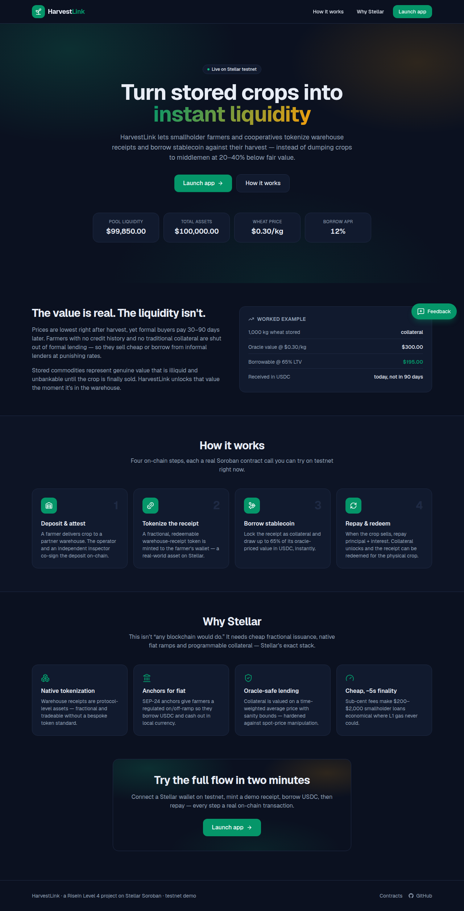
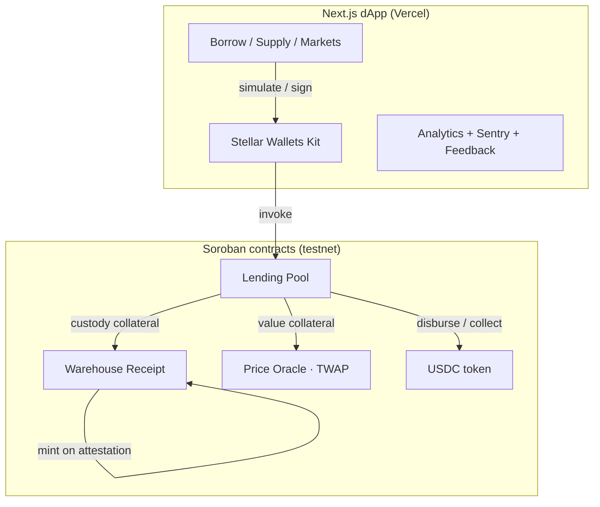
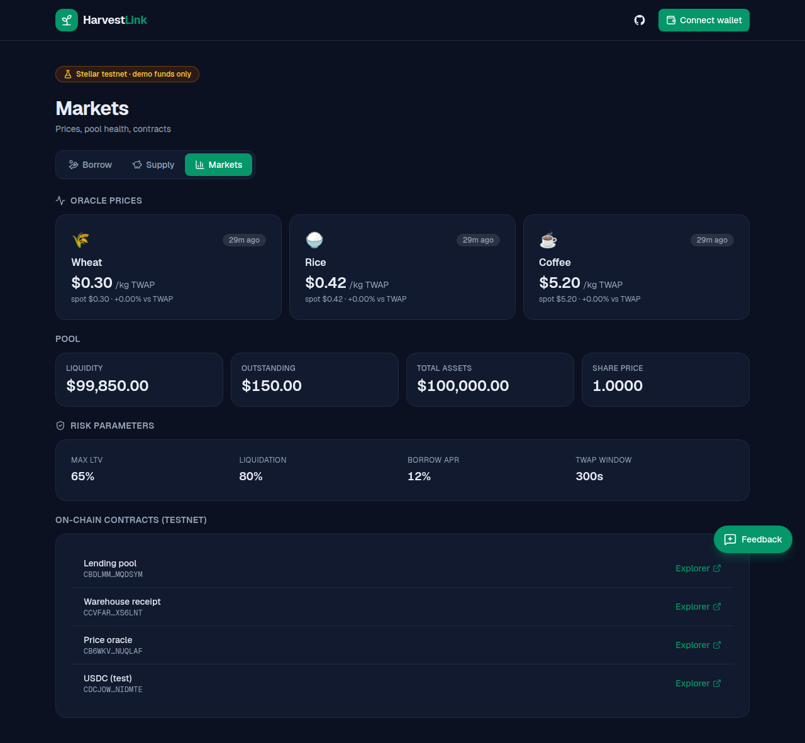
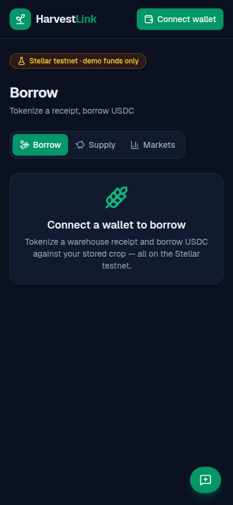

# 🌾 HarvestLink

**Warehouse receipt financing on Stellar.** Smallholder farmers and cooperatives
tokenize crops stored in a warehouse and borrow stablecoin against them —
instead of dumping the harvest to middlemen at 20–40% below fair value while
they wait 30–90 days to get paid.

> RiseIn Level 4 (Green Belt) submission — a production-ready MVP on the Stellar
> testnet with real Soroban smart contracts, a polished dApp, monitoring, and
> analytics.

<p align="center">
  
</p>

---

## 🔗 Links

| | |
|---|---|
| **Live demo** | _add your Vercel URL here after deploying `web/`_ |
| **Demo video** | _add your Loom/YouTube link here_ |
| **Network** | Stellar Testnet |

### Deployed contracts (testnet)

| Contract | Address | Explorer |
|---|---|---|
| Lending pool | `CBDLMMONZHBJVZVPUCC267KXSXJR6F3GT3Y56R3K6NYSBIKMZ2MQDSYM` | [view](https://stellar.expert/explorer/testnet/contract/CBDLMMONZHBJVZVPUCC267KXSXJR6F3GT3Y56R3K6NYSBIKMZ2MQDSYM) |
| Warehouse receipt | `CCVFARC3PQS7OW22TSRZNSTHTGXAIMNCSFY52WYWGSU72JBCYNXS6LNT` | [view](https://stellar.expert/explorer/testnet/contract/CCVFARC3PQS7OW22TSRZNSTHTGXAIMNCSFY52WYWGSU72JBCYNXS6LNT) |
| Price oracle | `CB6WKVUSDSNYRTHE3IJRIMPIPPYDD32FSGSHW3VLUTLY2TCRYPNUQLAF` | [view](https://stellar.expert/explorer/testnet/contract/CB6WKVUSDSNYRTHE3IJRIMPIPPYDD32FSGSHW3VLUTLY2TCRYPNUQLAF) |
| USDC (test) | `CDCJOWQYCVCSAOPAYMD4U2S342TVDPKSSCMTY54NWBEXYNR57UNIDMTE` | [view](https://stellar.expert/explorer/testnet/contract/CDCJOWQYCVCSAOPAYMD4U2S342TVDPKSSCMTY54NWBEXYNR57UNIDMTE) |

---

## The problem

Prices are lowest right after harvest, yet formal buyers pay 30–90 days after
delivery. Farmers with no credit history and no traditional collateral are shut
out of formal lending, so they either **sell immediately to middlemen at 20–40%
below fair price**, or **borrow from informal lenders at punishing rates**.

Stored commodities represent genuine value that is **illiquid, unbankable and
untradeable** until the crop is finally sold — and the people who need liquidity
the most have the least access to it. This is the classic *warehouse receipt
financing* problem, usually run by slow, paper-based, regionally siloed
institutions.

## What HarvestLink does

Four on-chain steps, each a real Soroban contract call:

1. **Deposit & attest** — a farmer delivers crop to a partner warehouse; the
   operator and an independent inspector **co-sign** the deposit on-chain.
2. **Tokenize** — a fractional, redeemable **warehouse-receipt token** is minted
   to the farmer's wallet (a real-world asset on Stellar).
3. **Borrow** — the receipt is locked as collateral and the farmer draws up to
   **65% of its oracle-priced value** in USDC, instantly.
4. **Repay & redeem** — when the crop sells, the farmer repays principal +
   interest; collateral unlocks and the receipt can be redeemed for the crop.

Liquidity providers deposit USDC into the pool and earn the interest farmers
pay. If a loan's collateral value falls below the liquidation threshold, anyone
can liquidate it.

## Why Stellar

This isn't "any blockchain would do." It needs three primitives that are
unusually well-integrated on Stellar:

- **Native tokenization** — warehouse receipts are protocol-level, fractional
  assets, no bespoke token standard required.
- **Anchors (SEP-24/6/12/10)** — a regulated fiat on/off-ramp so a farmer
  borrows USDC and cashes out in local currency (TRY/KES/NGN/INR).
- **Soroban + Reflector** — programmable collateral logic and an on-chain
  commodity/FX price feed, with sub-cent fees and ~5s finality that make
  $200–$2,000 smallholder loans economical.

---

## Architecture



The **lending pool** is the orchestrator. It reads the **oracle** (a
time-weighted average price, never spot), custodies **receipt** tokens as
collateral, and moves **USDC** in and out. See
[docs/ARCHITECTURE.md](docs/ARCHITECTURE.md) for the full data model, math, and
security notes.

### Contracts (`contracts/`)

| Crate | Responsibility | Highlights |
|---|---|---|
| [`oracle`](contracts/oracle) | Commodity/FX price feed | **TWAP** + per-update **deviation bounds** to resist spot-price manipulation |
| [`receipt`](contracts/receipt) | Warehouse-receipt token | **Attestation-gated** minting (warehouse + inspector), fractional, redeemable |
| [`lending-pool`](contracts/lending-pool) | Collateralized lending | LP shares (vault model), LTV borrow, linear interest, liquidation |
| [`token`](contracts/token) | Mock USDC (SEP-41) | Testnet faucet; replaced by anchor-issued USDC on mainnet |

All four are `#![no_std]`, use the `#[contractevent]` API for structured events,
and are covered by **25 unit + integration tests** exercising the full
borrow → interest → repay and price-drop → liquidation flows.

### Security design

- **Oracle-safe valuation.** Collateral is valued on a TWAP with sanity bounds —
  a deliberate response to the February 2026 Stellar lending exploit caused by
  naive spot-price oracle usage.
- **Multi-party attestation.** Receipts require the warehouse operator *and* an
  independent inspector to co-sign, mitigating fake/duplicate receipts.
- **Conservative LP accounting.** Accrued-but-unpaid interest is excluded from
  pool assets; it only lifts the share price once actually paid in.

---

## Tech stack

- **Contracts:** Rust · `soroban-sdk` 27 · Stellar CLI 27 · `wasm32v1-none`
- **Frontend:** Next.js 16 (App Router) · React 19 · TypeScript · Tailwind v4
- **Stellar:** `@stellar/stellar-sdk` · `@creit.tech/stellar-wallets-kit`
  (Freighter, xBull, Albedo, Lobstr, Rabet, Hana)
- **Data:** SWR (auto-revalidating on-chain reads via simulation)
- **Monitoring:** Vercel Analytics (usage) · Sentry (errors) · in-app feedback

## Repository structure

```
.
├── contracts/            # Soroban workspace (Rust)
│   ├── token/            # mock USDC (SEP-41 + faucet)
│   ├── oracle/           # price feed + TWAP + deviation bounds
│   ├── receipt/          # attestation-gated warehouse receipts
│   └── lending-pool/     # collateral, interest, liquidation, LP shares
├── web/                  # Next.js dApp
│   └── src/
│       ├── app/          # routes: landing, /app, /api/feedback
│       ├── components/   # UI, panels, wallet, feedback widget
│       ├── lib/          # stellar client, contracts, config, monitoring
│       └── hooks/        # SWR data hooks + tx-action hook
├── scripts/              # deploy_testnet.sh, set_price.sh
├── deployments/          # testnet.json (contract addresses)
└── docs/                 # architecture, onboarding, screenshots
```

---

## Getting started

### 1. Contracts

```bash
# Toolchain (once): https://developers.stellar.org/docs/build/smart-contracts/getting-started/setup
rustup target add wasm32v1-none
cargo install --locked stellar-cli   # or download a release binary

cd contracts
cargo test          # 25 tests: token, oracle, receipt, full pool integration
stellar contract build   # -> target/wasm32v1-none/release/*.wasm
```

### 2. Deploy to testnet (optional — a live deployment already exists)

```bash
./scripts/deploy_testnet.sh
# deploys, initializes and wires all four contracts, seeds prices + liquidity,
# and writes deployments/testnet.json
```

### 3. Frontend

```bash
cd web
cp .env.local.example .env.local   # defaults already point at the live deployment
npm install
npm run dev                        # http://localhost:3000
```

The app connects to a Stellar wallet on **testnet** (Freighter recommended). Try
the full flow: mint a demo receipt → borrow USDC → repay.

---

## Try it in 2 minutes (testnet)

**In the app:** connect a testnet wallet → **Borrow** tab → *Get 1,000 kg demo
receipt* → enter a borrow amount → **Borrow USDC**. Then **Supply** → *Get 10,000
test USDC* to try the LP side.

**Or from the CLI** (proves the exact on-chain calls the UI makes):

```bash
POOL=CBDLMMONZHBJVZVPUCC267KXSXJR6F3GT3Y56R3K6NYSBIKMZ2MQDSYM
RECEIPT=CCVFARC3PQS7OW22TSRZNSTHTGXAIMNCSFY52WYWGSU72JBCYNXS6LNT
YOU=$(stellar keys address <your-testnet-key>)

# 1. mint a 1,000 kg demo wheat receipt
stellar contract invoke --id $RECEIPT --source <key> --network testnet -- \
  request_demo_receipt --caller $YOU --crop WHEAT

# 2. borrow 150 USDC against it
stellar contract invoke --id $POOL --source <key> --network testnet -- \
  borrow --borrower $YOU --crop WHEAT --collateral_amount 10000000000 --borrow_amount 1500000000
```

See [docs/ONBOARDING.md](docs/ONBOARDING.md) for the full step-by-step user
guide used to onboard pilot testers.

---

## Monitoring & analytics

- **Usage analytics** — Vercel Analytics with custom events on every meaningful
  action (`wallet_connect`, `borrow`, `repay`, `supply`, `feedback_submit`, …),
  emitted from [`src/lib/monitoring.ts`](web/src/lib/monitoring.ts).
- **Error tracking** — Sentry (`@sentry/browser`), initialized only when
  `NEXT_PUBLIC_SENTRY_DSN` is set, plus a global error boundary and structured
  console logging as a fallback.
- **Feedback** — an in-app widget posts to `/api/feedback`, which logs each entry
  and (optionally) forwards it to a Discord/Slack/Formspree webhook.

## Screenshots

| Landing | Dashboard (Markets) | Mobile |
|---|---|---|
|  |  |  |

## Roadmap

**MVP (this repo, testnet)** — single-region pilot, wheat/rice/coffee, deployed
contracts, web dashboard, scripted price feed.

**Toward mainnet:**
- Live **Reflector** commodity + FX feeds; audited, TWAP-hardened contracts.
- Real anchor integration (SEP-24) for fiat on/off-ramp per region.
- Multi-crop, multi-warehouse; secondary market for receipt tokens.
- Optional parametric crop insurance layered on the same collateral rails.

## License

[MIT](LICENSE)
